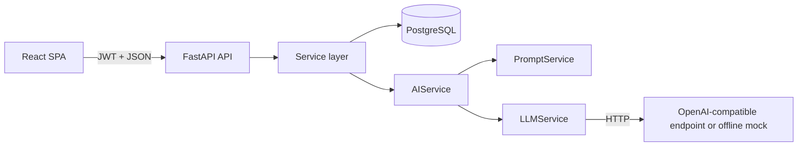
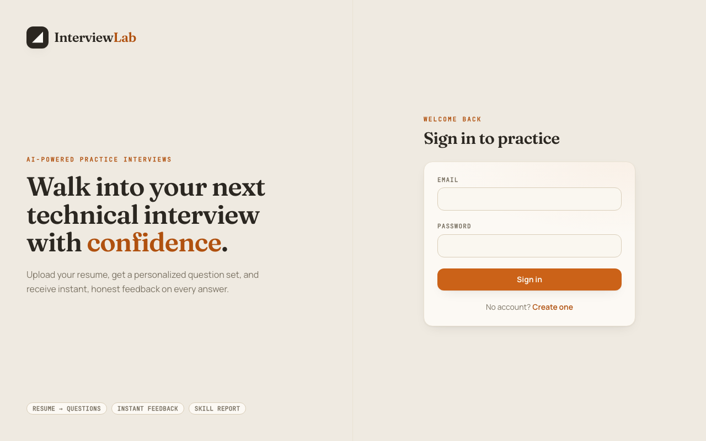
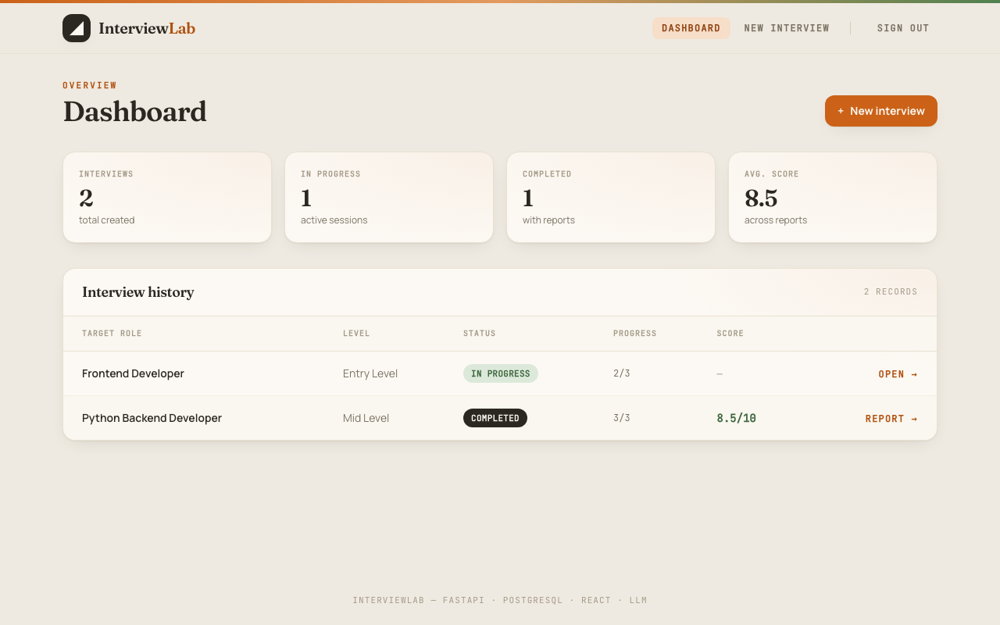
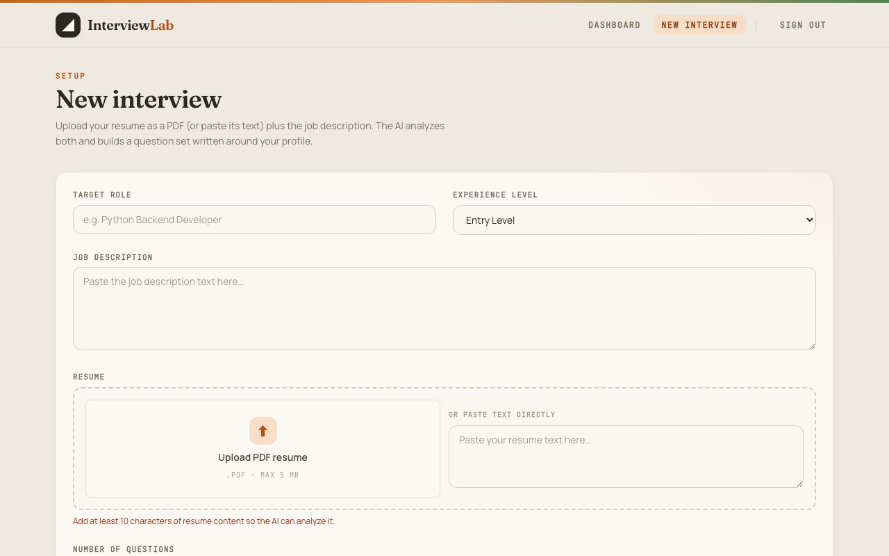
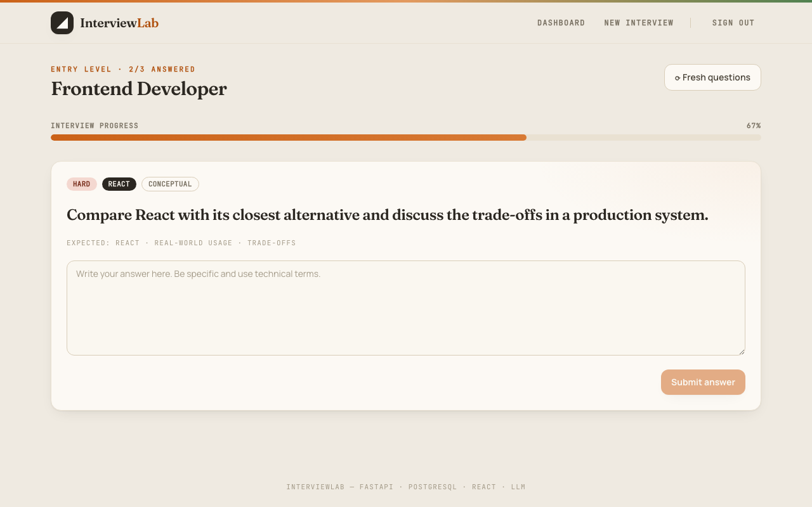
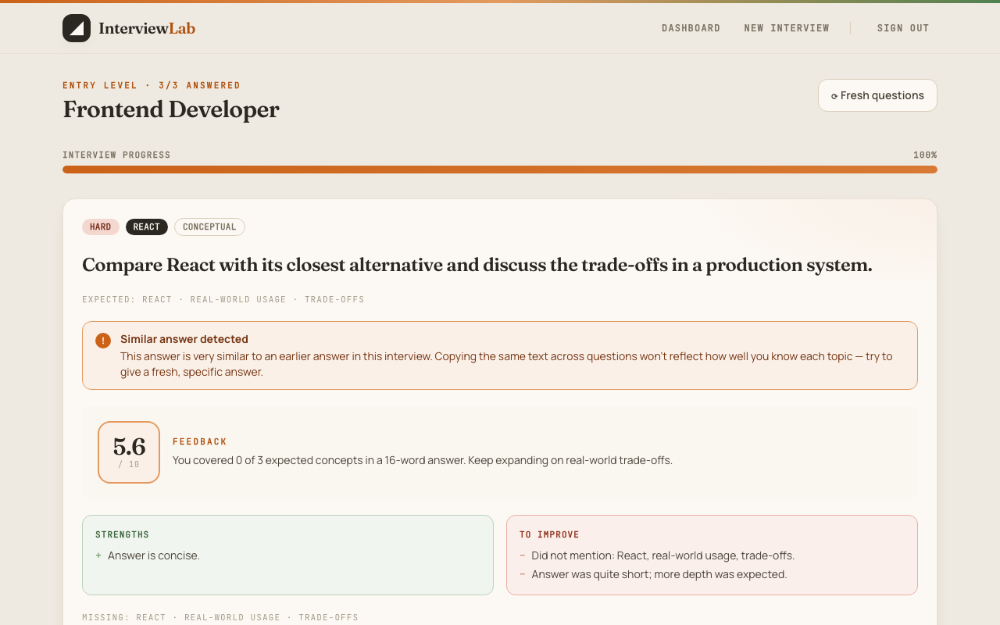
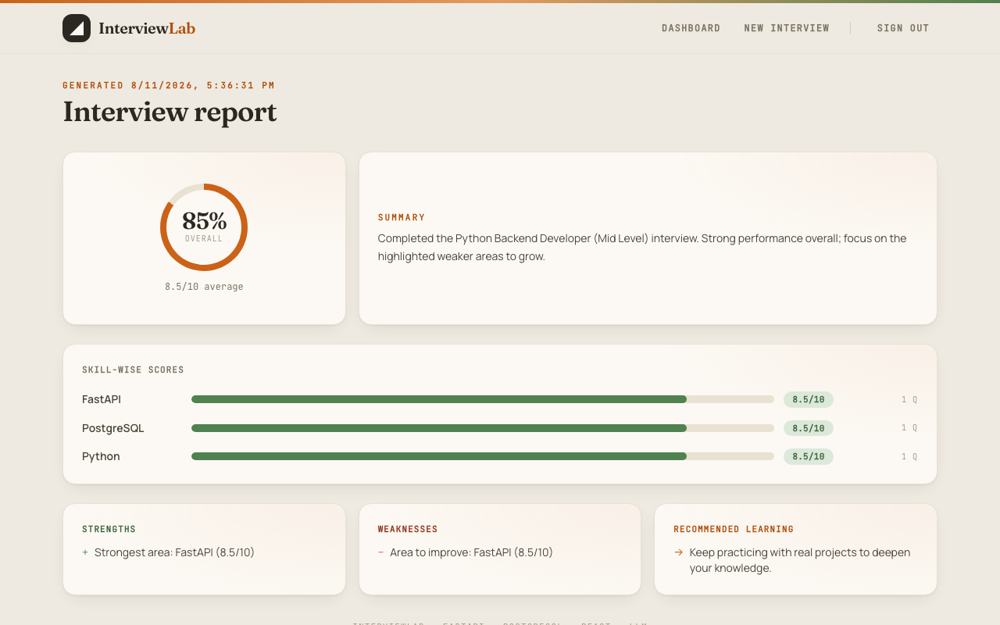

# 🤖 AI Interviewer

An AI-powered technical interview platform. A candidate uploads their **resume as a
PDF** (or pastes it as text) along with a **job description**, chooses a **target role**
and **experience level**, and the system
analyzes the match, generates personalized interview questions, evaluates each written
answer with an LLM, adapts difficulty to performance, and produces a final report with
skill-wise scores and learning recommendations.

Built as a **portfolio project** demonstrating the full software development lifecycle:
planning → architecture → AI integration → database → API → frontend → testing → Docker →
CI/CD → deployment → documentation.

> **Zero-config demo:** it runs out of the box with an offline **mock AI provider**
> (`LLM_PROVIDER=mock`). No API key needed. Point it at a real model with one env var.

---

## Table of Contents

1. [Overview](#overview)
2. [Problem Statement](#problem-statement)
3. [Features](#features)
4. [Architecture](#architecture)
5. [Tech Stack](#tech-stack)
6. [System Workflow](#system-workflow)
7. [Database Design](#database-design)
8. [API Endpoints](#api-endpoints)
9. [AI Pipeline](#ai-pipeline)
10. [Prompt Engineering](#prompt-engineering)
11. [Adaptive Difficulty](#adaptive-difficulty)
12. [Testing](#testing)
13. [Docker Setup](#docker-setup)
14. [Environment Variables](#environment-variables)
15. [Local Development](#local-development)
16. [Deployment](#deployment)
17. [CI/CD](#cicd)
18. [Screenshots](#screenshots)
19. [Future Improvements](#future-improvements)
20. [Lessons Learned](#lessons-learned)
21. [Author](#author)

---

## Overview

The app answers one question: **"How well does this candidate fit this role, and how
good are their answers?"** It turns a resume + job description into a full, automated,
personalized technical interview with scored feedback — the way a human technical
interviewer would plan and run an interview, minus the human.

The backend is a clean FastAPI REST API; the frontend is a small React SPA; all AI work
flows through a single swappable `AIService` abstraction.

## Problem Statement

- Candidates preparing for technical interviews often practice **generic** question
  banks, wasting time on topics that don't match the target role.
- Feedback on practice answers is usually **missing or delayed**; nobody tells you
  *which* concepts you skipped.
- There is no easy way to measure **skill-by-skill** performance over an interview.

**AI Interviewer** solves this with LLM-powered personalization: role-specific question
generation, instant structured feedback per answer, adaptive difficulty, and a final
report with skill-wise scores and concrete next steps.

## Features

- 🔐 **JWT auth** — register/login, bcrypt-hashed passwords, per-user data isolation.
- 📄 **Resume + job description analysis** — candidate skills, required skills, gaps, topics.
- 🆙 **PDF resume upload** — drag & drop a PDF; text is extracted server-side with
  `pypdf` and shown for confirmation before the interview is created.
- ❓ **Personalized question generation** — role-, level- and resume-aware, deduplicated.
  "Fresh questions" regenerates only the *unanswered* set, so you never repeat yourself.
- ✍️ **Answer evaluation** — 0–10 score, strengths, weaknesses, feedback, missing concepts.
- ⚠️ **Duplicate-answer detection** — pasting the same answer for multiple questions is
  caught and flagged with a warning instead of silently passing.
- 📈 **Adaptive difficulty** — rule-based (no ML) adjustment after every answer.
- 📊 **Final report** — overall + skill-wise scores, summary, recommendations.
- 🎨 **Distinctive UI** — warm, medium-tone "InterviewLab" aesthetic with self-hosted
  fonts (Fraunces, Manrope, JetBrains Mono), layered gradient backgrounds and staggered
  micro-animations.
- 🧪 **60 automated tests** with a fully mocked LLM (no API key, no network).
- 🐳 **Docker Compose** — `docker compose up --build` runs the entire stack.
- 🔄 **CI/CD** — GitHub Actions: tests, frontend build, Docker build.

## Architecture

```
                    ┌──────────────────────────────────────────────┐
                    │            React + Vite + Tailwind          │
                    │   Login · Dashboard · Interview · Report    │
                    └───────────────────┬──────────────────────────┘
                                        │  HTTP/JSON + JWT Bearer
                                        ▼
                    ┌──────────────────────────────────────────────┐
                    │                FastAPI (REST)                │
                    │  routers ──▶ services ──▶ models / DB        │
                    │        (no business logic in routers)        │
                    └───────┬──────────────────────┬───────────────┘
                            │                      │
                            ▼                      ▼
              ┌─────────────────────┐   ┌──────────────────────────┐
              │     SQLAlchemy      │   │        AIService         │
              │       + Alembic     │   │  analyze · generate ·    │
              │                     │   │  evaluate · report       │
              │      PostgreSQL     │   │          │               │
              │  (SQLite in tests)  │   │          ▼               │
              └─────────────────────┘   │  PromptService (templates)│
                                        │  LLMService (transport,   │
                                        │    retries, JSON parsing) │
                                        │  Mock / OpenAI-compatible │
                                        └──────────────────────────┘
```



**Key principle: Router → Service → Database/AI.** No business logic lives in routers;
every LLM call goes through the AI service. This is what makes the app testable and the
LLM provider swappable.

## Tech Stack

| Layer | Technology |
|-------|-----------|
| Backend | Python 3.12+, FastAPI, Pydantic v2, SQLAlchemy 2, Alembic |
| Database | PostgreSQL 16 (SQLite in tests) |
| Auth | JWT (PyJWT) + bcrypt |
| AI | OpenAI-compatible chat API (configurable) + offline mock provider |
| Frontend | React 18, Vite 5, Tailwind CSS 3, React Router 6, Axios |
| Testing | pytest, FastAPI TestClient, httpx |
| DevOps | Docker, Docker Compose, GitHub Actions |

## System Workflow

```
Dashboard
   │
   ├─▶ New Interview (role, level, JD, resume, #questions)
   │        │
   │        ├─▶ POST /interviews
   │        ├─▶ POST /interviews/{id}/analyze   (AI: skills, gaps, topics)
   │        └─▶ POST /interviews/{id}/generate-questions  (AI, deduplicated)
   │
   └─▶ Interview page (one question at a time)
            │
            ├─▶ POST /questions/{id}/answer     (AI evaluation + adaptive difficulty)
            │
            └─▶ POST /interviews/{id}/complete  (deterministic scoring + AI narrative)
                     │
                     └─▶ Report page (overall, skill scores, recommendations)
```

## Database Design

```
users (id, email UNIQUE, full_name, hashed_password, created_at, updated_at)
  │ 1 ── N
interviews (id, user_id FK, target_role, experience_level, job_description,
            resume_text, number_of_questions, duration_minutes,
            current_difficulty, analysis JSON, status, created_at, updated_at)
  │ 1 ── N
questions (id, interview_id FK, text, skill, difficulty, question_type,
           expected_concepts JSON, order_index, status)
  │ 1 ── 1
answers (id, question_id FK UNIQUE, text, created_at, updated_at)
  │ 1 ── 1
evaluations (id, answer_id FK UNIQUE, score, strengths JSON, weaknesses JSON,
             feedback, missing_concepts JSON, model_used, created_at, updated_at)

interviews 1 ── 1 interview_reports (id, interview_id FK UNIQUE, overall_score,
             average_score, summary, strengths JSON, weaknesses JSON,
             recommendations JSON, created_at, updated_at)
interview_reports 1 ── N skill_scores (id, report_id FK, skill, score, question_count)
```

Migrations are managed with **Alembic** (`alembic upgrade head`). Foreign keys cascade
on user deletion; a question can only have one answer and one evaluation.

## API Endpoints

Base URL: `http://localhost:8000` (or `http://localhost:8080/api` via the Docker nginx).

| Method | Path | Auth | Description |
|--------|------|------|-------------|
| POST | `/auth/register` | – | Create account, returns JWT |
| POST | `/auth/login` | – | Login, returns JWT |
| GET | `/auth/me` | ✅ | Current user profile |
| POST | `/interviews` | ✅ | Create an interview |
| GET | `/interviews` | ✅ | List my interviews (with score/progress) |
| GET | `/interviews/{id}` | ✅ | Interview detail |
| POST | `/interviews/{id}/analyze` | ✅ | AI resume + JD analysis |
| POST | `/interviews/{id}/generate-questions` | ✅ | AI question generation (dedup; `replace_pending` regenerates only unanswered) |
| GET | `/interviews/{id}/questions` | ✅ | List questions in order |
| POST | `/questions/{id}/answer` | ✅ | Submit + evaluate an answer (flags duplicates) |
| POST | `/interviews/{id}/complete` | ✅ | Finalize and build the report |
| GET | `/interviews/{id}/report` | ✅ | Fetch the final report |
| POST | `/resume/extract` | – | Upload a PDF resume, returns its extracted text |
| GET | `/health` | – | Liveness probe |

Interactive docs: **`http://localhost:8000/docs`** (Swagger UI).

### Example: create an interview

```bash
curl -X POST http://localhost:8000/interviews \
  -H "Authorization: Bearer <token>" \
  -H "Content-Type: application/json" \
  -d '{
    "target_role": "Python Backend Developer",
    "experience_level": "Entry Level",
    "job_description": "Build REST APIs with Python, FastAPI, PostgreSQL. Docker is a plus.",
    "resume_text": "Built APIs with Python and FastAPI, used PostgreSQL, containerized with Docker.",
    "number_of_questions": 5
  }'
```

```json
{
  "id": 12,
  "target_role": "Python Backend Developer",
  "experience_level": "Entry Level",
  "number_of_questions": 5,
  "duration_minutes": null,
  "status": "created",
  "analysis": null,
  "created_at": "2026-08-11T10:00:00Z",
  "updated_at": "2026-08-11T10:00:00Z"
}
```

### Example: submit an answer

```bash
curl -X POST http://localhost:8000/questions/34/answer \
  -H "Authorization: Bearer <token>" \
  -H "Content-Type: application/json" \
  -d '{"text": "asyncio uses an event loop to run coroutines concurrently..."}'
```

```json
{
  "question_id": 34,
  "evaluation": {
    "score": 8.4,
    "strengths": ["Correctly explained the event loop"],
    "weaknesses": ["Did not mention cooperative multitasking"],
    "feedback": "Strong understanding of async execution...",
    "missing_concepts": ["cooperative multitasking"]
  },
  "next_difficulty": "hard"
}
```

### Error handling

- `401` invalid/missing token · `403` accessing another user's resource
- `404` missing resource · `409` duplicate email
- `422` Pydantic validation failure · `503` AI provider unavailable · `502` AI returned invalid output
- Errors never leak API keys or stack traces; full details go to server logs.

## AI Pipeline

All LLM usage funnels through one abstraction in `backend/app/services/ai/`:

```
ai_service.py      # LLMAIService: builds prompts → calls LLM → validates with Pydantic
mock_ai_service.py # MockAIService: deterministic offline provider (default)
base.py            # AIService interface + Pydantic output models (CandidateAnalysis, ...)
prompt_service.py  # assembles messages from templates
llm_service.py     # HTTP transport: auth header, timeouts, retries, JSON extraction
```

- The provider is selected by `LLM_PROVIDER` (`mock` | anything else → OpenAI-compatible API).
- Every AI output is validated by a Pydantic model; malformed or missing fields raise a
  handled error instead of corrupting the database.
- Retries with backoff handle 429 / 5xx / timeouts; all failures surface as app-level
  errors (503/502) with the real detail only in logs.

```
Resume + JD  ──▶  CandidateAnalysis (skills, gaps, topics)
Analysis     ──▶  QuestionData[] (text, skill, difficulty, type, concepts)
Question + answer ──▶  AnswerEvaluation (score 0-10, strengths, weaknesses, feedback)
Scores       ──▶  ReportSummary (summary, strengths, weaknesses, recommendations)
```

## Prompt Engineering

Templates live in `backend/app/prompts/interview_prompts.py`. Each prompt:

- States a clear **role** ("You are an expert technical interviewer...").
- Provides the **input context** (role, level, JD, resume, existing questions, scores).
- Requests **strict JSON matching an explicit schema** (printed in the prompt).
- Is **bounded** (`_truncate`) so long resumes don't blow the context window.
- Passes **previously asked questions** so the model avoids duplicates.

Example (question generation):

```
Generate 3 interview questions for a candidate applying to 'Python Backend
Developer' at the 'Entry Level' level.
Difficulty target: medium.

RESUME/JOB ANALYSIS: {"candidate_skills": [...], "skill_gaps": [...]}

PREVIOUSLY ASKED QUESTIONS (must not repeat): ...
Respond with STRICT JSON only matching: {"questions": [{...}]}
```

## Adaptive Difficulty

A deliberately simple, deterministic rule — no machine learning:

| Answer score | Effect on next question difficulty |
|--------------|------------------------------------|
| `>= 8`       | increase (easy→medium→hard, clamped) |
| `5 – 7.9`    | keep current difficulty |
| `< 5`        | decrease (hard→medium→easy, clamped) |

Implemented in `EvaluationService.adapt_difficulty`. The resulting target is stored on
the interview (`current_difficulty`), shown in the UI, used to pick the next pending
question, and used as the difficulty target if questions are regenerated.

**Why rule-based?** See [Design Decisions](docs/DECISIONS.md) — it is transparent,
testable, and sufficient; ML would be over-engineering for this requirement.

## Testing

51 tests across 8 files (pytest + FastAPI TestClient + in-memory SQLite):

| File | Covers |
|------|--------|
| `test_auth.py` | register, duplicate email, login, wrong password, `/me` |
| `test_interviews.py` | create/list/get, validation, 403/404 isolation, analysis |
| `test_questions.py` | generation, dedup, batch limits, ordering, ownership |
| `test_answers.py` | submission, blank rejection, already-answered, adaptive difficulty |
| `test_evaluation.py` | 503/502 AI failure paths, JSON parsing edge cases |
| `test_reports.py` | score math, skill aggregation, completion flow, permissions |
| `test_ai_service.py` | mock provider behavior (deterministic, offline) |

The LLM is **fully mocked** (`ControllableAIService`) — tests never touch the network or
an API key. SQLite foreign keys are enabled in tests so constraint bugs are caught in CI.

```bash
cd backend
python -m pytest -q        # 51 passed
ruff check app tests       # lint (see pyproject.toml for the one intentional ignore)
```

## Docker Setup

```bash
docker compose up --build
```

Services:

| Service  | Port | Notes |
|----------|------|-------|
| `db`     | 5432 | PostgreSQL 16, health-checked |
| `backend`| 8000 | runs `alembic upgrade head` then uvicorn |
| `frontend`| 8080 | nginx serving the built SPA, proxying `/api` → backend |

Open **http://localhost:8080**. The backend runs migrations on startup, so `docker
compose up` is all you need. No secrets are baked into images — everything comes from
environment variables (see `docker-compose.yml` and `.env.example`).

## Environment Variables

See **`.env.example`** (root and `backend/`). Backend:

| Variable | Default | Purpose |
|----------|---------|---------|
| `DATABASE_URL` | `postgresql+psycopg://...` | SQLAlchemy connection string |
| `SECRET_KEY` | `change-me-in-production` | JWT signing key (use a long random string) |
| `JWT_ALGORITHM` | `HS256` | JWT algorithm |
| `ACCESS_TOKEN_EXPIRE_MINUTES` | `1440` | Token lifetime |
| `LLM_PROVIDER` | `mock` | `mock` = offline; otherwise OpenAI-compatible API |
| `LLM_API_KEY` | *(empty)* | Provider API key (only needed for real LLM) |
| `LLM_MODEL` | `gpt-4o-mini` | Model name |
| `LLM_BASE_URL` | `https://api.openai.com/v1` | Any OpenAI-compatible endpoint |
| `LLM_TIMEOUT_SECONDS` / `LLM_MAX_RETRIES` | `60` / `2` | Transport resilience |
| `CORS_ORIGINS` | `http://localhost:5173,http://localhost:8080` | Comma-separated origins |

Frontend: `VITE_API_URL` is not required — Vite proxies `/api` in dev and nginx proxies
it in Docker.

## Local Development

**Backend**

```bash
cd backend
python3 -m venv .venv && source .venv/bin/activate
pip install -r requirements.txt
cp .env.example .env            # edit DATABASE_URL / LLM_PROVIDER as you like
alembic upgrade head
uvicorn app.main:app --reload --port 8000
```

**Frontend**

```bash
cd frontend
npm install
npm run dev                     # http://localhost:5173 (proxies /api → :8000)
```

Quick local run without PostgreSQL: set `DATABASE_URL=sqlite:///./dev.db`.

## Deployment

### Backend (Render / Railway)
1. Set the **start command**: `alembic upgrade head && uvicorn app.main:app --host 0.0.0.0 --port $PORT`.
2. Add env vars from `.env.example` (use a **managed PostgreSQL** `DATABASE_URL`).
3. Set `LLM_PROVIDER` to your provider and `LLM_API_KEY` (never commit it).

### Frontend (Vercel)
1. Build command `npm run build`, output directory `dist`.
2. Add a rewrite so `/api/*` proxies to your backend origin
   (see `vercel.json` example below).

```json
{
  "rewrites": [{ "source": "/api/:path*", "destination": "https://your-backend.onrender.com/:path*" }]
}
```

Alternatively use the `Dockerfile`s directly on any container platform.

## CI/CD

`.github/workflows/ci.yml` runs on every push/PR to `main`:

1. **Backend** — Python 3.12, install deps, `ruff check`, `pytest -q`, import sanity check.
2. **Frontend** — Node 20, `npm ci`, `npm run build`.
3. **Docker** — `docker compose build` validates both images.

The pipeline fails the build on any test failure.

## Screenshots

Captured from the running app (mock AI provider). The UI uses a warm, medium-tone
palette (warm paper + burnt-copper accent, Fraunces/Manrope/JetBrains Mono typography).

| | |
|---|---|
| **Login** | **Dashboard** |
|  |  |
| **New interview (PDF upload)** | **Interview** |
|  |  |
| **Duplicate-answer warning** | **Report** |
|  |  |

## Future Improvements

- **Real provider defaults** — currently `mock`; flip to a real LLM in production.
- **Follow-up questioning** — ask the candidate to elaborate on weak answers.
- **Question timing** — enforce `duration_minutes` with a countdown.
- **Question types** — add runnable coding exercises (judge execution, not just text).
- **Team/assessment reports** — share a report link, hire-manager view.
- **Richer analytics** — improvement over repeated interviews.
- **Batch/shortest-path recommendations** — which topic to study next based on gaps.

## Lessons Learned

- **PostgreSQL constraints catch real bugs.** The evaluation insert once referenced an
  answer id that didn't exist yet; SQLite tests passed (FKs off by default) but Postgres
  failed. Enabling SQLite FKs in tests now catches this class of bug in CI.
- **An AI abstraction is worth it.** Being able to run the entire app offline with the
  mock provider made development, testing and demoing dramatically easier.
- **Validate AI output at the boundary.** Assuming the LLM returns valid JSON breaks the
  app; Pydantic validation turns "maybe" into "handled error".
- **Deterministic math + LLM narrative** is the right split for a report you can trust.
- **Small functions + a service layer** kept every file readable — which is what makes a
  project educational to revisit and extend.

## Author

Prashamsa Ghimire — building this as a portfolio project to demonstrate full-stack AI
software engineering. See also [Design Decisions](docs/DECISIONS.md) for the reasoning
behind every major choice.
